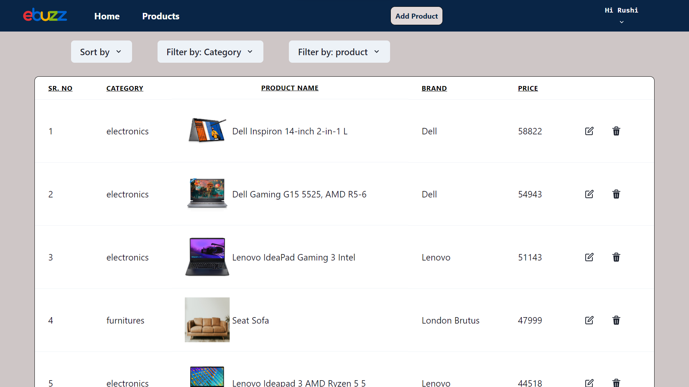

# Welcome to ebuzz

<h3>ebuzz is an American multinational e-commerce platform that facilitates online consumer-to-consumer and business-to-consumer sales. The website allows individuals and businesses to buy and sell a wide variety of goods and services, including electronics, fashion, collectibles, home and garden products, sporting goods, and vehicles.This is a collaborative Project from Masai School in the Construct Week With the 5 team members within 5 Days.
</h3>

# Deployed URL 👉 [Click here](https://ret-vv97.vercel.app/)

## Our Team Members

- Vishal Verma (Team Leader) (My Linkedin profile :- https://www.linkedin.com/in/vishal-varma-96a9bb241/)

- Rushi Joshi (My Linkedin profile :- https://www.linkedin.com/in/rushijoshi3798/)

- Ayush Kaushik (My Linkedin profile :- https://www.linkedin.com/in/ayush-kaushik-81418a250/)

- Abhishek Jha (My Linkedin profile :- https://www.linkedin.com/in/abhishekjha96/)

- Kashif Jamal (My Linkedin profile :- )
   

 
<h4 align="center">💻 Tech Stack</h4>
 

 
 
 
 
   
  
 
 
 
 

 

<h3 align="center">Tools</h3> 
  
  
   
    

 

## Let's Dive into What we have made

## Home Page :

## Products Page :

## Cart Page :

## Checkout Page :

## Sign-Up Page :

## Login Page :

## Admin Welcome:

## All Products:

## Add Products:

## Our Learnings

On this journey we faced many issues, but we keep motivated each other with patience.

- We all learned how to read and understand the code of other team members.

- We learned how to write more efficient and clean code.

- Even though We also learned how to plan a project and how to execute it step by step.

- By this Project we have learned how to collaborate and communicate with team effectively and improving the productivity.

- We also got a glimpse of using GitHub for the version control.

Source Code(GitHub link):- https://github.com/Vv97/rampant-quiet-9349/

## Show your support

Give a ⭐️ if you like this project!

### Thank you

